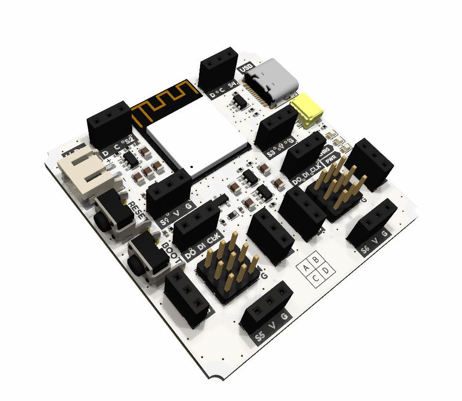

# Crabik Slot ESP32-S3 Hardware

Crabik Slot was created so that you can quickly prototype, research and educational projects, because it makes it easy to create and test without having to assemble everything on a breadboard and dig into a pile of wires.

Schematics and board designs (KiCad projects), distributed as open hardware and available under CERN-OHL-W v2 license.